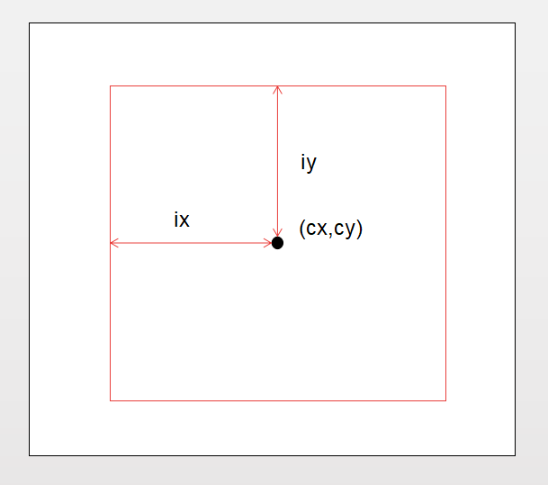
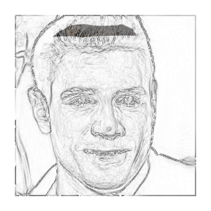
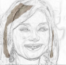
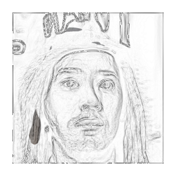
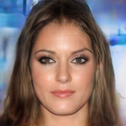
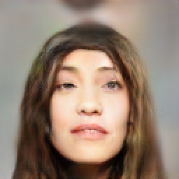
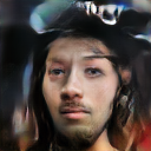
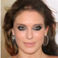
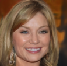
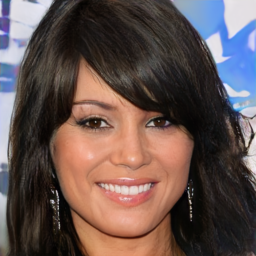

# Pix2Pix PGGAN(Using PGGAN as Pix2Pix for generating high resolution images)
  This is an implementation of Pix2Pix PGGAN on python 3.6 and Tensorflow. People can input original images such as face edges or some other objects and get the specific results from the outputs with high resolution. Pix2Pix PGGAN is based on Progressive Growth GAN released by NVDIA. There are two structures such as None U-Net structure and U-Net structure will be implemented in the Pix2Pix PGGAN.
The code is designed to be extended easily. You can change the code such as input resolution and output resolution to what you need easily.
<h2>The structure of Pix2Pix PGGAN</h2>

  

  
Graph 1: None U-Net Structure

 

None U-Net Structure is a simple method to implement Pix2Pix PGGAN. We only need to use CNN to capture condition images’ features. The counts of CNN layers are the more the better, which are depended on our graphic card. The short coming of None U-net structure is the G loss is higher than D loss.
 

 
 

  

Graph 2: U-Net Structure

U-Net Structure is a better way to implement Pix2Pix PGGAN. The feature of U-Net Structure is wo concatenate specific layers of G based on None U-Net structure. The U-Net Structure can reduce the G loss and get better results. The short coming of U-Net structure is it will take more time on training.
 

<h2>Data preparation</h2>
 Celeba-HQ dataset’s 20,000 images are used as targets in the demo. Face edges images(condition images) with hair color masks are captured by Celeba-HQ dataset. Hair color masks are captured by using M-RCNN released by Facebook.
We can download Celeba-HQ in this url.
https://drive.google.com/drive/folders/1jU-hzyvDZNn_M3ucuvs9xxtJNc9bPLGJ
 

Condition images can be face edges, scene images or other interesting objects. Condition images are ‘tips’ for G to learn. However, specific objects’ images which have spatial similarity with targets are better than the images which have no spatial similarity with targets.
  

  

We can use dataset-tool to change the dataset into tf-record format. Put faceA tf-record files into ./dataset/faceA/ and put faceB tf-record files into ./dataset/faceB/
  

  <pre>
  <code>python dataset_tool.py create_newoneface C:/Users/Output/faceA/ C:/Input/faceA/ --cx=150 --cy=150 --ix=128 --iy=128</code>
  </pre>
  

  --cx and --cy are the center location of the images. --ix and --iy are the inner area of images which are the targets. Details are shown in the below graph. ix and iy must be 2**n.
  

  

Graph 3: DataCapture

<h2>Training</h2>
Please install python3.6 , tensorflow-gpu, CUDA, cudnn and other libraries in requirement-pip.txt.Input the below code to install libraries and start training.
<pre><code>pip install tensorflow-gpu
</code></pre>
<pre><code>pip install -r requirement-pip.txt
</code></pre>
<pre><code>python train.py
</code></pre>

Here is my training environment.

GPU:GTX 1080Ti
  

  

RAM:16GB
  

  

CUDA:9.0
  

  

cudnn:7.1.3
  

  
<h2>Results</h2>

  
  
  

  
Graph 4: Inputs

  

  
  
  

  
Graph 5: Outputs

  

  
  
  

  
Graph 6: targets

  

  None U-Net structure results are still in training, here is the intermediate training results. The weight file can be download in this url.

<strong><a href="https://research.nvidia.com/publication/2017-10_Progressive-Growing-of">https://research.nvidia.com/publication/2017-10_Progressive-Growing-of</a></strong>

  U-Net structure results are coming soon.
  

<h2>Testing</h2>
  You can run import_example.py to input images, then generate specific outputs. For more details, you can read the code.
<h2>Future Works</h2>
  <ul>
  <li>Release an enhancer to make the results more beautiful.
  </li>
</ul>
<ul>
  <li>There are many interesting way to improve this gan. For example, we can concat some pose features into the latens_in to induct the gan to generate images with specific poses. 
  </li>
</ul>
<ul>
  <li>What’s more, we can use this network to generate people with specific clothes. It’s difficult to get precise results, but it’s one more way to achieve this goal.
  </li>
</ul>

<h2>Contact</h2>

If you have any questions about this network, please feel free to contact me with 

<strong><a href="mailto:leongmacau1991@gmail.com">leongmacau1991@gmail.com</a></strong>

If you have any questions about the licence, please contact NVDIA Research group. You can find their mail address in here.
  

<strong><a href="https://research.nvidia.com/publication/2017-10_Progressive-Growing-of">https://research.nvidia.com/publication/2017-10_Progressive-Growing-of</a></strong>
